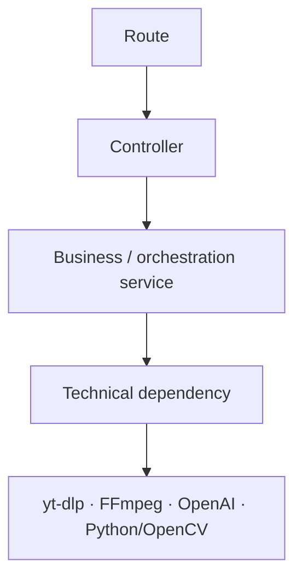
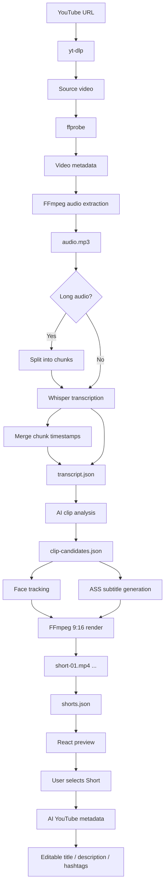
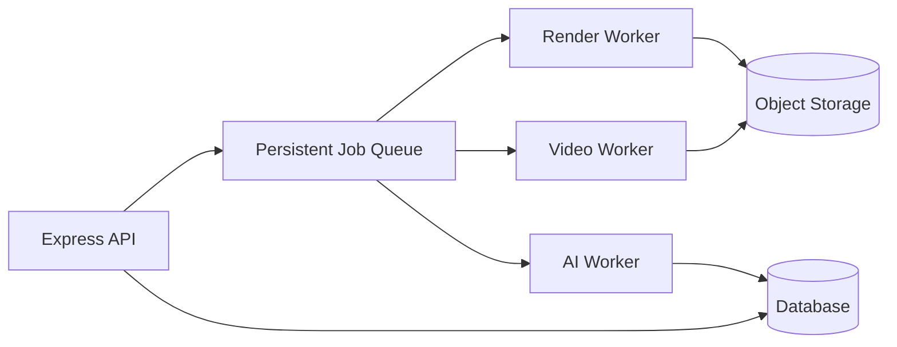
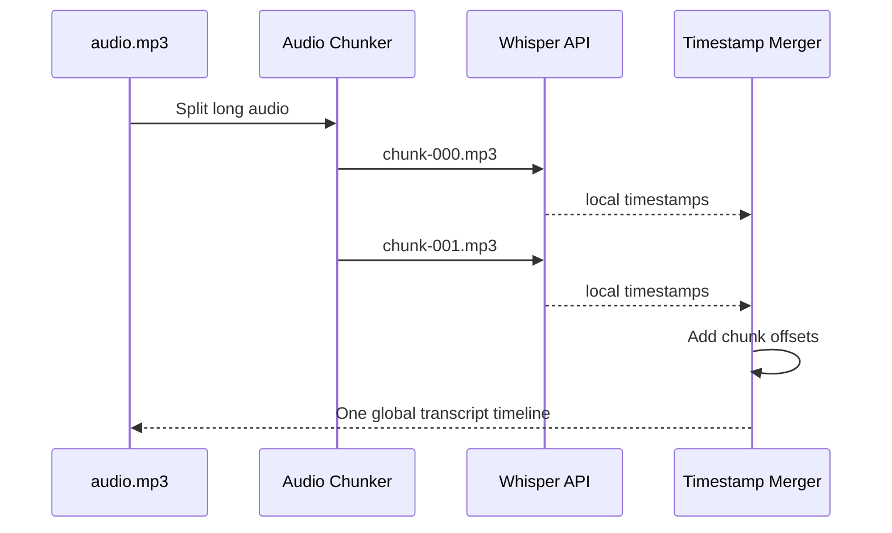
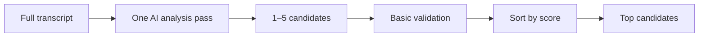
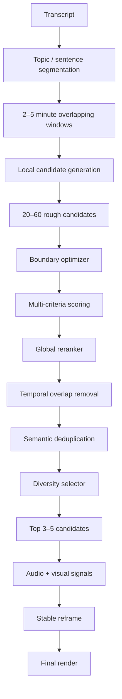
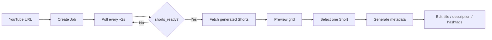
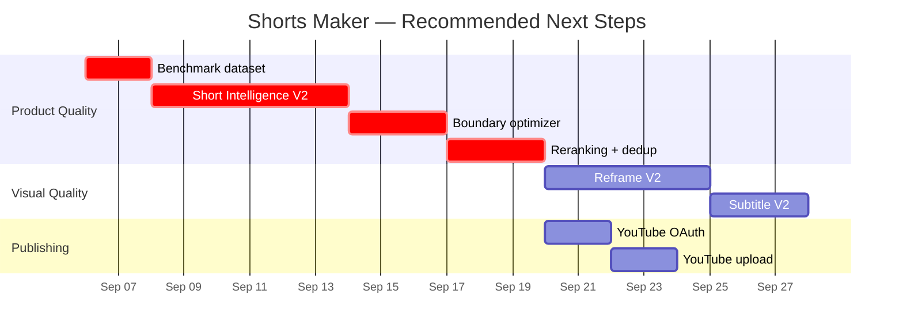

# 🎬 Shorts Maker

<div align="center">

**Turn long YouTube videos into vertical, subtitled, AI-assisted Shorts.**

`React` · `TypeScript` · `Express` · `OpenAI` · `Whisper` · `FFmpeg` · `yt-dlp` · `Python` · `OpenCV`

**Current status:** 🟡 **V1 technically advanced — core Short quality still needs a major V2**

</div>

---

## 🚦 Project Status at a Glance

| Area                           | Status             | Notes                                                       |
| ------------------------------ | ------------------ | ----------------------------------------------------------- |
| YouTube ingestion              | ✅ Ready           | `yt-dlp` download works                                     |
| Video probing                  | ✅ Ready           | `ffprobe` metadata extraction                               |
| Audio extraction               | ✅ Ready           | Mono 16 kHz MP3                                             |
| Long-video transcription       | ✅ Ready           | Chunked Whisper transcription + merged timestamps           |
| AI clip selection              | ⚠️ P0 issue        | Technically works, but quality is currently not acceptable  |
| Vertical rendering             | ✅ Ready           | 1080×1920 with FFmpeg                                       |
| Burned subtitles               | ✅ Ready           | ASS subtitles                                               |
| Auto reframe                   | ⚠️ Provisional     | Dynamic face tracking works but feels unstable / unpleasant |
| Shorts API                     | ✅ Ready           | List + MP4 streaming                                        |
| React frontend                 | ✅ Ready           | Job creation, polling, previews, selection                  |
| AI metadata                    | ✅ Ready           | Title, description, hashtags                                |
| Editable metadata UI           | ✅ Ready           | User can edit before publishing                             |
| YouTube OAuth                  | ⬜ Not implemented | Next publishing milestone                                   |
| YouTube upload                 | ⬜ Not implemented | Depends on OAuth                                            |
| Production-ready Short quality | ❌ Not ready       | Highest-priority product problem                            |

> [!IMPORTANT]
> The technical pipeline works almost end-to-end, but **the current Short-selection/editing algorithm is not good enough to ship**.  
> The next major engineering focus should be **Short Intelligence V2**, not simply finishing OAuth.

---

# 🧭 Product Goal

The target V1 user journey is:


### Later — not V1

- TikTok / Instagram publishing
- Scheduling
- Music selection + ducking
- B-roll insertion
- Advanced animated captions
- Smart zooms
- Multi-user accounts
- Billing
- Analytics

---

# 🏗️ Architecture

```text
shorts-maker/
├── client/
│   ├── src/
│   │   ├── components/
│   │   │   └── ShortCard.tsx
│   │   ├── services/
│   │   │   └── video-api.ts
│   │   ├── types/
│   │   │   ├── generated-short.ts
│   │   │   ├── processing-job.ts
│   │   │   └── youtube-metadata.ts
│   │   ├── App.tsx
│   │   ├── App.css
│   │   ├── index.css
│   │   └── main.tsx
│   ├── .env.example
│   ├── package.json
│   └── vite.config.ts
│
└── server/
    ├── python/
    │   ├── detect_face_focus.py
    │   ├── detect_face_track.py
    │   └── requirements.txt
    ├── src/
    │   ├── controllers/
    │   │   └── video.controller.ts
    │   ├── routes/
    │   │   ├── health.routes.ts
    │   │   └── video.routes.ts
    │   ├── services/
    │   │   ├── audio-chunk.service.ts
    │   │   ├── clip-analysis.service.ts
    │   │   ├── clip-generation.service.ts
    │   │   ├── ffmpeg.service.ts
    │   │   ├── reframe.service.ts
    │   │   ├── short.service.ts
    │   │   ├── subtitle.service.ts
    │   │   ├── transcription.service.ts
    │   │   ├── video-processing.service.ts
    │   │   ├── video.service.ts
    │   │   ├── youtube-metadata.service.ts
    │   │   └── ytdlp.service.ts
    │   ├── types/
    │   │   ├── audio-chunk.ts
    │   │   ├── clip-candidate.ts
    │   │   ├── generated-short.ts
    │   │   ├── processing-job.ts
    │   │   ├── reframe-focus.ts
    │   │   ├── transcript.ts
    │   │   ├── video-metadata.ts
    │   │   └── youtube-metadata.ts
    │   ├── app.ts
    │   └── index.ts
    ├── .env.example
    ├── package.json
    └── tsconfig.json
```

## Backend responsibility flow



The intended backend structure is:

```text
route → controller → service → technical dependency
```

A repository layer should only be introduced when a real database is added.

---

# ⚙️ Processing Pipeline



---

# 🖥️ Backend

## Stack

- Node.js
- TypeScript
- Express 5
- OpenAI SDK
- FFmpeg / ffprobe
- yt-dlp
- Python
- OpenCV

Current development environment used Node 24.

## Required system tools

```bash
node --version
npm --version
ffmpeg -version
ffprobe -version
yt-dlp --version
python3 --version
```

---

# 🔐 Environment Variables

Never commit real credentials.

Example backend `.env.example`:

```env
PORT=3000
CLIENT_ORIGIN=http://localhost:5173

OPENAI_API_KEY=your_api_key_here
CLIP_ANALYSIS_MODEL=gpt-5.6-luna

TRANSCRIPTION_CHUNK_SECONDS=900
```

Frontend `.env.example`:

```env
VITE_API_URL=http://localhost:3000
```

> [!CAUTION]
> Real API keys and OAuth tokens belong in `.env` or private storage only.

---

# 📦 Job Model

Jobs are currently stored in memory:

```ts
Map<string, ProcessingJob>;
```

This is intentional for the current V1 prototype.

### Consequence

Restarting the backend loses the in-memory job registry.

Generated files remain on disk, but job state does not.

### Future production architecture



Possible future choices:

- PostgreSQL / Supabase
- Redis + BullMQ
- S3-compatible object storage

---

# 🎙️ Long-Video Transcription

Long videos are supported by splitting the extracted audio into smaller chunks.

Normal configuration:

```env
TRANSCRIPTION_CHUNK_SECONDS=900
```

That means approximately **15-minute audio chunks**.



The merged transcript keeps global timestamps so the rest of the pipeline does not need to know whether transcription was chunked.

---

# 🧠 Current Clip Analysis — P0 Problem

The current selection logic is roughly:



This works technically, but it is **far too simple editorially**.

## Why it fails

A good Short needs more than a high-level timestamp guess.

It needs:

- a strong opening
- enough context to stand alone
- a clear payoff
- natural start and end cuts
- minimal dead air
- no repeated idea across selected clips
- good pacing
- visually stable framing
- a clip length appropriate to the content

The current system does not model these dimensions deeply enough.

> [!WARNING]
> A valid MP4 is not the same thing as a publishable Short.

---

# 🚀 Short Intelligence V2 — Recommended Direction



## Priority matrix

| Improvement                                      |   Importance | Why                                                  |
| ------------------------------------------------ | -----------: | ---------------------------------------------------- |
| Human benchmark on 5–10 representative videos    |    **10/10** | Prevents optimizing blindly                          |
| Hierarchical / window-based candidate generation |    **10/10** | Better coverage of long videos                       |
| Precise start/end boundary optimization          |    **10/10** | Prevents awkward or contextless cuts                 |
| Global reranker                                  |     **9/10** | Separates discovery from final selection             |
| Temporal overlap removal                         |     **9/10** | Avoids near-duplicate clips                          |
| Semantic deduplication                           |     **9/10** | Avoids repeating the same idea                       |
| Result diversity                                 |   **8.5/10** | Gives the user genuinely different choices           |
| Audio + visual signals                           |     **9/10** | Transcript alone misses energy and scene context     |
| Modern face/person tracking                      |     **9/10** | Current reframe is only provisional                  |
| Scene-cut awareness                              |     **8/10** | Prevents unnatural crop motion across cuts           |
| Dynamic editing / silence trimming               |     **8/10** | Improves pacing                                      |
| Subtitle V2                                      |     **7/10** | Better visual polish                                 |
| YouTube OAuth                                    | **6/10 now** | Important, but secondary until clip quality improves |

---

# 🎯 Benchmark Before Optimization

Create a small repeatable benchmark set:

- podcast / interview
- teaching / lecture
- solo talking-head
- two-person conversation
- 1h+ long video
- multilingual / Hebrew content if relevant

Score each generated Short on:

| Criterion          |    Score |
| ------------------ | -------: |
| Interesting moment |       /5 |
| Hook               |       /5 |
| Start cut          |       /5 |
| End cut            |       /5 |
| Standalone clarity |       /5 |
| Payoff             |       /5 |
| Non-redundancy     |       /5 |
| Framing            |       /5 |
| Subtitles          |       /5 |
| Publishable        | Yes / No |

### Main product metric

```text
Publishable@5
```

> Out of the 5 proposed Shorts, how many would a real user actually publish?

A reasonable initial V1 goal is **1–2 genuinely publishable Shorts on most benchmark videos**.

---

# 🎞️ Rendering

Generated Shorts are currently rendered:

```text
1080 × 1920
9:16
H.264
AAC
ASS subtitles burned in
```

The current dynamic reframe:

- samples face detections approximately every `0.75s`
- uses OpenCV Haar-based face detection
- tracks horizontal focus
- uses full source height
- avoids zoom
- falls back to centered framing if detection quality is poor

### Known limitation

The implementation works, but movement can feel uncomfortable.

This should be replaced later by a more stable strategy using concepts such as:

- MediaPipe / modern face detection
- person detection
- tracker identity
- scene-cut resets
- dead zones
- speed limits
- easing / smoothing
- speaker-aware framing

---

# 💬 Subtitles

Current subtitle generation uses word-level Whisper timestamps and creates ASS cues.

Current behavior:

- small word groups
- burned directly into the video
- vertical-safe placement
- readable outline / shadow

Future subtitle V2 ideas:

- active-word highlighting
- stronger RTL / Hebrew handling
- adaptive line wrapping
- keyword emphasis
- templates / themes
- animated caption styles

---

# 🌐 Current API

```text
GET  /api/health

POST /api/videos
GET  /api/videos/:jobId

GET  /api/videos/:jobId/shorts
GET  /api/videos/:jobId/shorts/:shortId/video

POST /api/videos/:jobId/shorts/:shortId/metadata
```

## Create a processing job

```bash
curl -X POST http://localhost:3000/api/videos \
  -H "Content-Type: application/json" \
  -d '{"url":"https://www.youtube.com/watch?v=VIDEO_ID"}'
```

Example response:

```json
{
  "job": {
    "id": "uuid",
    "sourceUrl": "https://www.youtube.com/watch?v=VIDEO_ID",
    "status": "queued"
  }
}
```

## Processing states

```text
queued
↓
downloading
↓
probing
↓
extracting_audio
↓
audio_ready
↓
transcribing
↓
transcript_ready
↓
analyzing_clips
↓
clips_ready
↓
generating_shorts
↓
shorts_ready
```

Failure state:

```text
failed
```

---

# ⚛️ Frontend

The current React interface supports:



### Current UI features

- YouTube URL input
- Generate Shorts button
- processing status
- generated Short cards
- HTML5 video previews
- single-Short selection
- AI metadata generation
- editable metadata fields
- dark modern CSS

---

# 🔊 Known Frontend Audio Issue

Generated MP4 files contain an AAC audio track.

Audio has been confirmed to work when the backend MP4 URL is opened directly in Chrome.

A playback issue was observed in the embedded React `<video>` player even though:

```text
muted = false
volume = 1
```

This issue was intentionally postponed.

Do not treat it as a backend audio-generation failure unless new evidence appears.

---

# 📁 Generated Storage

Typical structure:

```text
storage/
├── videos/
│   └── JOB_ID/
├── audio/
│   └── JOB_ID/
│       ├── audio.mp3
│       └── chunks/
├── transcripts/
│   └── JOB_ID/
│       ├── transcript.json
│       └── chunks/
├── analysis/
│   └── JOB_ID/
│       └── clip-candidates.json
├── shorts/
│   └── JOB_ID/
│       ├── short-01.mp4
│       ├── short-02.mp4
│       ├── shorts.json
│       └── subtitles/
└── metadata/
    └── JOB_ID/
        └── short-01.json
```

`storage/` is ignored by Git.

---

# ▶️ Local Development

## Backend

```bash
cd server
npm install
npm run typecheck
npm run dev
```

Default backend:

```text
http://localhost:3000
```

## Frontend

```bash
cd client
npm install
npm run build
npm run dev
```

Default frontend:

```text
http://localhost:5173
```

If Vite runs on `127.0.0.1`, the backend currently allows both:

```text
http://localhost:5173
http://127.0.0.1:5173
```

---

# 🧪 Test URLs Used During Development

Short technical test:

```text
https://www.youtube.com/watch?v=Szox9wD4HRU
```

Longer-video test:

```text
https://www.youtube.com/watch?v=_Yk5dsZ0emA
```

---

# 🧹 Git / Security

Important ignored content should include:

```gitignore
.env
node_modules/
dist/
storage/
.venv/
```

Never commit:

- OpenAI API keys
- OAuth client secrets
- refresh tokens
- generated private user media

---

# 🗺️ Roadmap



The exact dates are illustrative; the priority order is what matters.

---

# ✅ Definition of V1 Done

V1 should not be considered complete merely because every API call succeeds.

A real V1 acceptance test is:

```text
Paste a long YouTube URL
↓
Wait for processing
↓
Receive 3–5 genuinely useful Short options
↓
Preview them
↓
Choose one
↓
Edit metadata
↓
Click Publish
↓
Short appears on YouTube
↓
App returns the published URL
```

The critical word is **genuinely useful**.

Until the generated Shorts are good enough that a user would realistically publish them, the product is still a technical prototype.

---

# 🧠 Engineering Principle

> **Do not optimize the automation around a bad editorial decision.**

Download, transcription, rendering and upload are infrastructure.

The product value lives in:

```text
finding the right moment
+
cutting it correctly
+
framing it well
+
making it publishable
```

That is the next major milestone.
